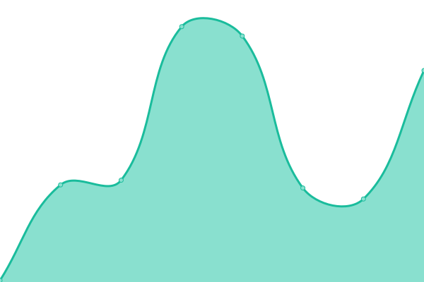
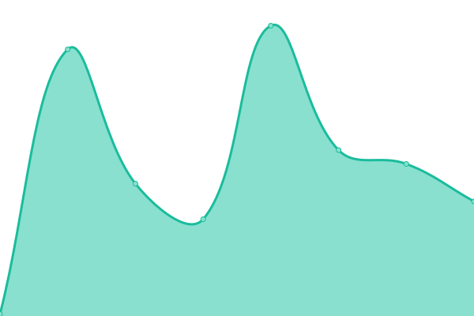

# [📈 Live Status](https://pluim003.github.io/upptime): <!--live status--> **🟧 Partial outage**

This repository contains the open-source uptime monitor and status page for [Dick Pluim](https://dickpluim.com), powered by [Upptime](https://github.com/upptime/upptime).

With [Upptime](https://upptime.js.org), you can get your own unlimited and free uptime monitor and status page, powered entirely by a GitHub repository. We use [Issues](https://github.com/pluim003/upptime/issues) as incident reports, [Actions](https://github.com/pluim003/upptime/actions) as uptime monitors, and [Pages](https://pluim003.github.io/upptime) for the status page.

<!--start: status pages-->
<!-- This summary is generated by Upptime (https://github.com/upptime/upptime) -->
<!-- Do not edit this manually, your changes will be overwritten -->
<!-- prettier-ignore -->
| URL | Status | History | Response Time | Uptime |
| --- | ------ | ------- | ------------- | ------ |
|  [Dick Pluim.com](https://dickpluim.com) | 🟩 Up | [dick-pluim-com.yml](https://github.com/pluim003/upptime/commits/HEAD/history/dick-pluim-com.yml) | 

 561ms
     
 | 

<a href="https://pluim003.github.io/upptime/history/dick-pluim-com">100.00%</a>
    

|  [KCG](https://kunstrijclubgroningen.nl) | 🟩 Up | [kcg.yml](https://github.com/pluim003/upptime/commits/HEAD/history/kcg.yml) | 

 4499ms
     
 | 

<a href="https://pluim003.github.io/upptime/history/kcg">100.00%</a>
    

|  [Pierced Arrows](https://www.piercedarrows.nl) | 🟩 Up | [pierced-arrows.yml](https://github.com/pluim003/upptime/commits/HEAD/history/pierced-arrows.yml) | 

 800ms
     
 | 

<a href="https://pluim003.github.io/upptime/history/pierced-arrows">94.40%</a>
    

|  My Grafana dashboard | 🟥 Down | [my-grafana-dashboard.yml](https://github.com/pluim003/upptime/commits/HEAD/history/my-grafana-dashboard.yml) | 

 547ms
     
 | 

<a href="https://pluim003.github.io/upptime/history/my-grafana-dashboard">0.00%</a>
    

|  Upptime-test-site | 🟥 Down | [upptime-test-site.yml](https://github.com/pluim003/upptime/commits/HEAD/history/upptime-test-site.yml) | 

 551ms
     
 | 

<a href="https://pluim003.github.io/upptime/history/upptime-test-site">0.00%</a>
    

<!--end: status pages-->

[**Visit our status website →**](https://pluim003.github.io/upptime)

## 📄 License

- Powered by: [Upptime](https://github.com/upptime/upptime)
- Code: [MIT](./LICENSE) © [Dick Pluim](https://dickpluim.com)
- Data in the `./history` directory: [Open Database License](https://opendatacommons.org/licenses/odbl/1-0/)
